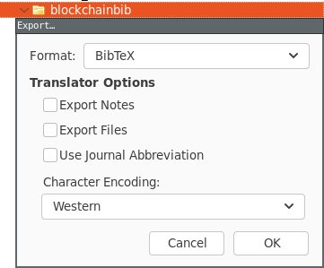

# Zotero enhancements 

## Update BibTeX.js export

Merge changes with current `BibTeX.js` Zotero exporter:
```bash
$ meld /home/$USER/snap/zotero-snap/common/Zotero/translators/BibTeX.js snap_zotero-snap_common_Zotero_translators_BibTeX_v2.js
```
Important changes are: 
```
var citeKeyFormat = "%a%y%t";
...
	} else if (field == "month") {
		var monthIndex = months.indexOf(value.toLowerCase());
		if (monthIndex != -1) {
			value = Zotero.Utilities.formatDate({month:monthIndex});
		} else {
			value += " ";
		}
...
		if (item.date) {
			if (value.includes(item.date)) {
				// value contains year and more
				item.date = value;
			} else {
				item.date = value+item.date;
			}
		} else {
			item.date = value;
		}
...
		if (item.date) {
			if (!item.date.includes(value)) {
				// date does not already contain year
				item.date += value;
			}
		} else {
			item.date = value;
		}
...
      var first_word = item["title"].toLowerCase().split(/\s+/g)[0];
      if (first_word.includes("-")) {
        return first_word;
      }
...
//writeField("annote", Zotero.Utilities.unescapeHTML(note["note"]));
...
//writeField("file", attachmentString.substr(1));
...
Zotero.write("\n}");
```

Export with `BibTeX` and encoding `Western` 


## Add custom PDF resolver

Go to `Edit -> Preferences -> Advanced -> Config Editor` and
then to `extensions.zotero.findPDFs.resolvers` and add the following json string:

```json
[{     "name": "URL Source",     "method": "GET",     "url": "{url}/#doi={doi}",     "mode": "html",     "selector": "#pdf",     "attribute": "href",     "automatic": false},{     "name":"Sci-Hub",     "method":"GET",     "url":"https://sci-hub.se/{doi}",     "mode":"html",     "selector":"#pdf",     "attribute":"src",     "automatic":false }]
```
